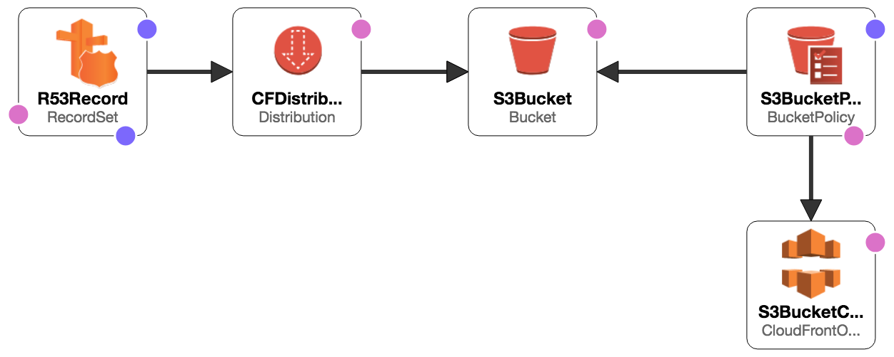

#### Demo #1 
This demo creates a static website using S3 and CloudFront: 


Deploy the template using this syntax: 
```bash
./deploy.sh any-subdomain
```

\* NOTE: the bash scripts hard-wire the DNS zone and SSL certificate to those of 'mycodefu.com', if you want to try this out use the template stand-alone or change the domain and SSL certificate ARN in the bash scripts to your own.